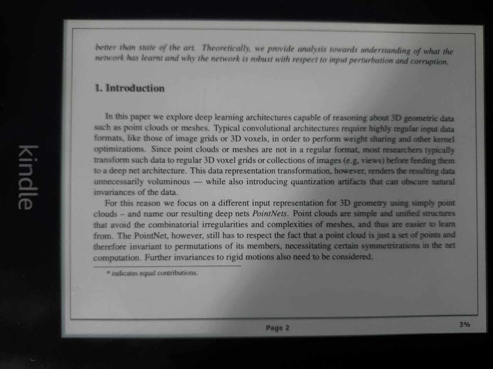
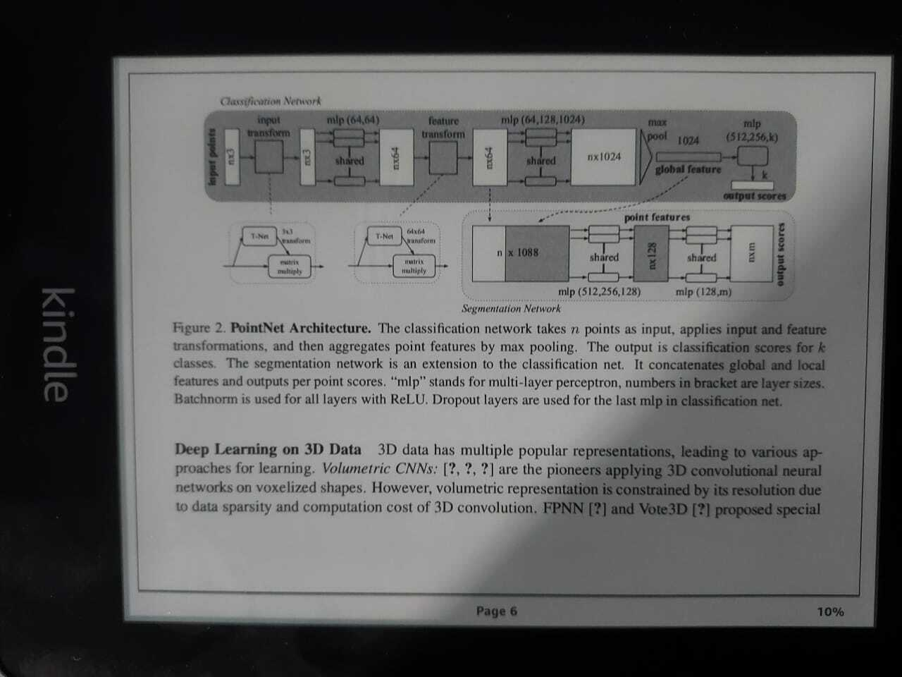
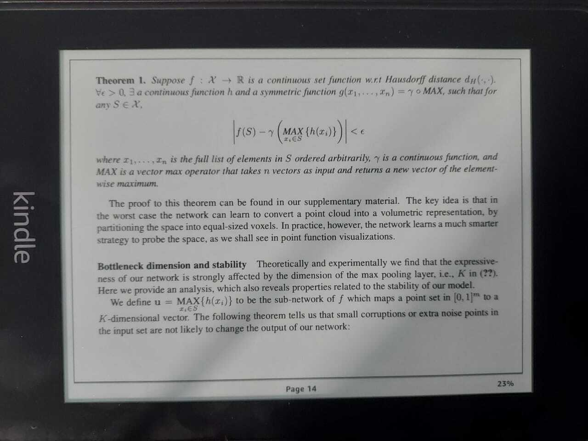
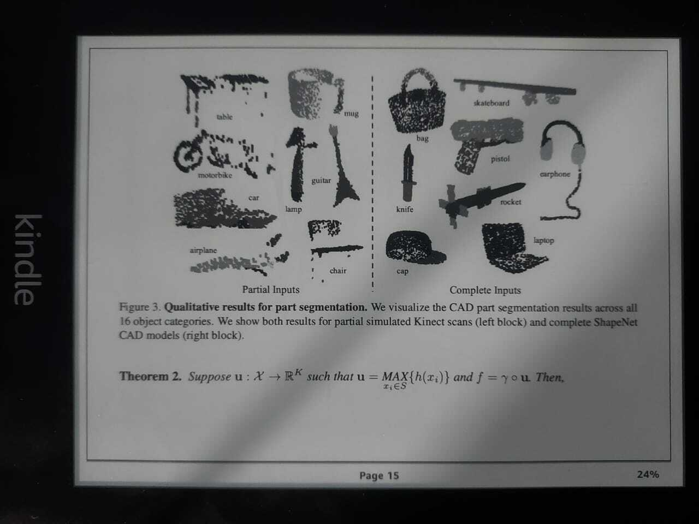
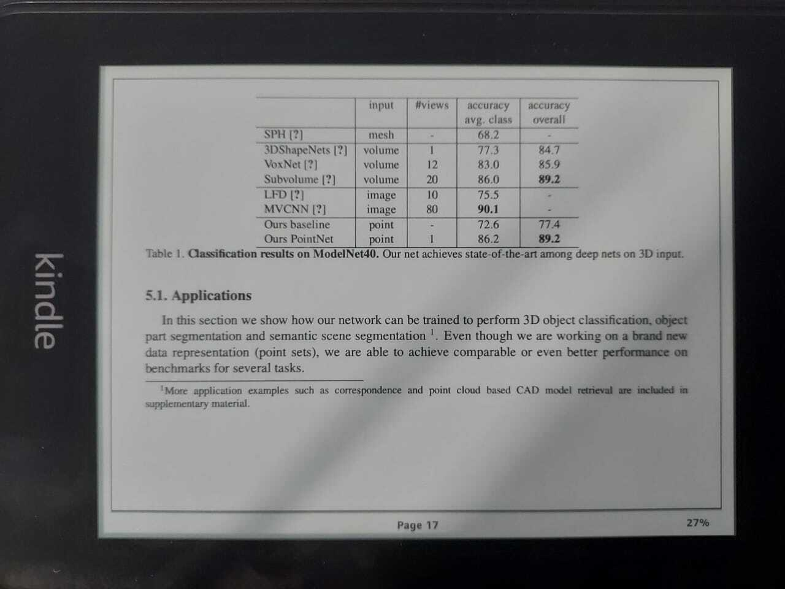
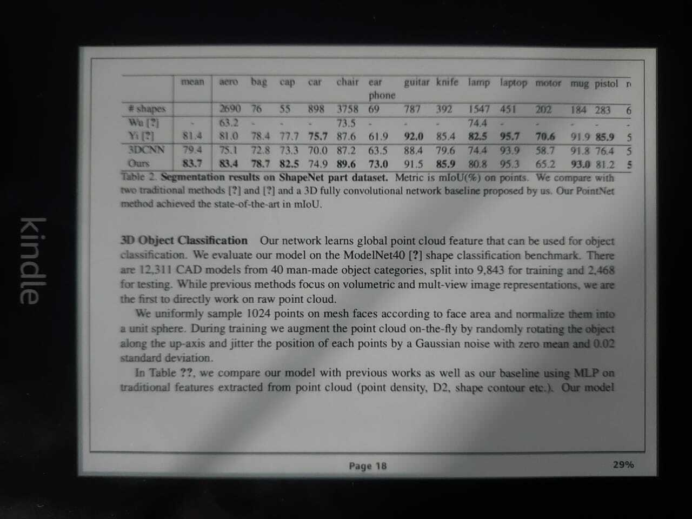

# Arxiv2Kindle

Arxiv2Kindle is a simple script written in python that converts LaTeX source downloaded from Arxiv and recompiles it to better fit a reading device (such as a Kindle).

## Features

- Arxiv2Kindle can render images, diagrams, tables and formulae.
- It also converts 2-column formats into a single column for ease of reading.
- Arxiv2Kindle can mail the converted pdf file to your kindle.

## Useage

Install the dependencies using `pip install -r requirements.txt`, preferrably inside a virtual environment.

Arxiv2Kindle can be used via a CLI:

```
Usage: arxiv2kindle.py [OPTIONS]

Options:
  -u, --arxiv_url TEXT    Arxiv URL
  -w, --width INTEGER     Width
  -h, --height INTEGER    Height
  -m, --margin FLOAT      Margin
  -l, --is_landscape      Flag: Is output landscape
  -g, --gmail TEXT        Your Gmail ID
  -k, --kindle_mail TEXT  Your Kindle ID
  --help
```

## Converted Samples















